# excel-vba-automation-project
This 7-part Excel-based project demonstrates the power of VBA and Macros in automating data-related tasks. Each part builds upon the previous one, introducing increasingly complex functionality — from cleaning and transforming data to automating weekly reports and working with user forms.

> ⚙️ Tools used: Microsoft Excel, Excel Macros, VBA

---
## 📚 Table of Contents

1. [Part 1: Macro Recorder, VBA Concepts & Logic Statements](#part-1-macro-recorder-vba-concepts--logic-statements)
2. [Part 2: Moving Beyond the Basics and Into VBA](#part-2-moving-beyond-the-basics-and-into-vba)
3. [Part 3: Preparing and Cleaning Up Data with VBA](#part-3-preparing-and-cleaning-up-data-with-vba)
4. [Part 4: Using VBA to Automate Excel Formulas](#part-4-using-vba-to-automate-excel-formulas)
5. [Part 5: Bringing It All Together – Weekly Report](#part-5-bringing-it-all-together--weekly-report)
6. [Part 6: Working with Excel VBA User Forms](#part-6-working-with-excel-vba-user-forms)
7. [Part 7: Importing Data from Text Files](#part-7-importing-data-from-text-files)


---

## Part 1: Macro Recorder, VBA Concepts & Logic Statements

In this section, we introduce the foundational concepts of Excel automation using the Macro Recorder and VBA. It's ideal for beginners transitioning from manual Excel tasks to programmable workflows.

### 🔹 Key Skills Covered
- Recording macros to automate repetitive Excel tasks
- Understanding generated VBA code from macros
- Using the VBA editor to modify and write procedures
- Implementing control flow using `If`, `Else`, `For`, `Do While`, and `Do Until` loops
- Working with Excel Object Model (Workbook, Worksheet, Range)

### 📂 Files Included
- `COM-InsertingAndFormattingText.xlsm`: Demonstrates macro-recorded automation for inserting and formatting cells
- `COM-ExcelVBALoops.xlsm`: Showcases various loop constructs in VBA to manipulate Excel data dynamically

### 🧰 Concepts Introduced
- **Macro Recorder**: Automatically generates VBA code based on recorded actions in Excel
- **VBA (Visual Basic for Applications)**: Object-oriented programming language integrated with Excel
- **Object Model**: Hierarchical structure of Excel elements that VBA interacts with
- **Procedures & Modules**: Basic building blocks for reusable and organized code

### 🎯 Learning Outcome
By the end of this part, you’ll be able to:
- Record and review macros
- Write and execute your first VBA procedure
- Use conditional logic and loops
- Automate common cell-level tasks like formatting and text insertion


### 📸 Screenshots

#### 🟢 Macro Recording and Formatting


#### 🔁 VBA Loops Example
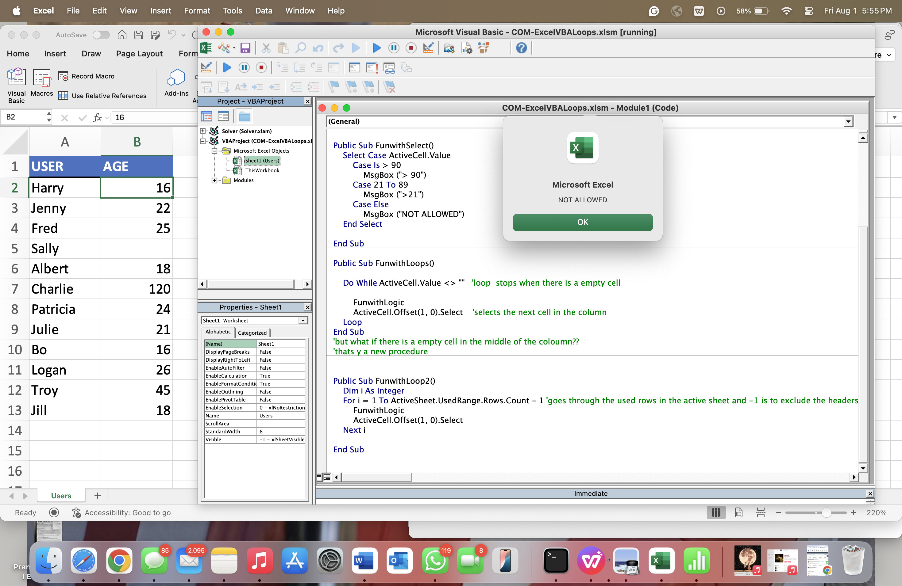

---

## Part 2: Moving Beyond the Basics and Into VBA

In this section, we move past macro recording and begin writing more customized VBA code. This part introduces how to manipulate Excel’s object model directly, build reusable procedures, and create interactive workflows with buttons.

### 🔹 Key Skills Covered
- Writing subroutines without macro recording
- Using Excel object references (`Range`, `Cells`, `Rows`)
- Automating sorting of tabular data
- Assigning VBA macros to buttons for interaction
- Improving code readability with structure and comments

### 📂 File Included
- `SortingRecords.xlsm`: Demonstrates how to write VBA code to sort a range of records and assign that macro to a button on the sheet.

### 🧰 Concepts Introduced
- **VBA Sort Method**:
  ```vba
  Range("A2:D20").Sort Key1:=Range("B2"), Order1:=xlAscending, Header:=xlYes

### 📸 Screenshots


#### 🖱️ User-Friendly Sort Button
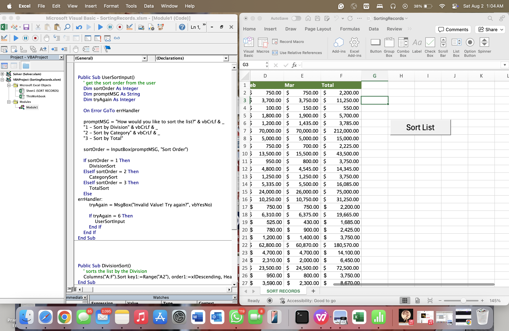

#### 🧑‍💻 User Input for Dynamic Sorting
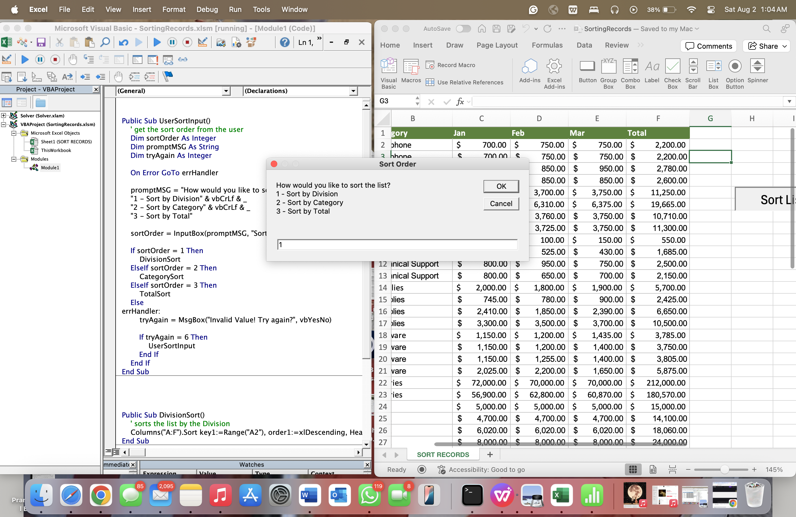

#### 🧮 Sorting Example in Action
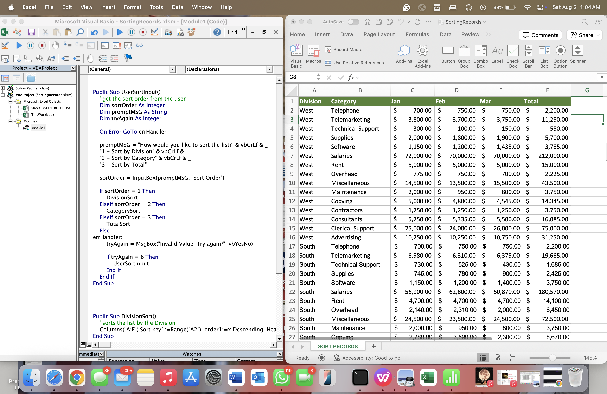

---

## Part 3: Preparing and Cleaning Up Data with VBA

This part focuses on automating **data cleanup across multiple sheets** using custom VBA procedures. You'll loop through worksheets, insert headers where missing, and apply consistent formatting — all with a single macro execution.

### 🔹 Key Skills Covered
- Looping through worksheets using `For Each`
- Dynamically checking for and inserting missing headers
- Reusable formatting of headers via a modular macro
- Structuring code for maintainability

### 📂 File Included
- `CleaningUpData.xlsm`: Automates cleanup and formatting across regional Excel sheets (East, West, North, South).

### 🧰 Concepts Introduced
- **Looping Over Worksheets**:
  ```vba
  For Each ws In Worksheets
      If Range("A1").Value <> "Division" Then
          InsertHeaders
      End If
      FormatHeader
  Next ws

### 📸 Screenshots

#### 🔍 Before Running the Macro
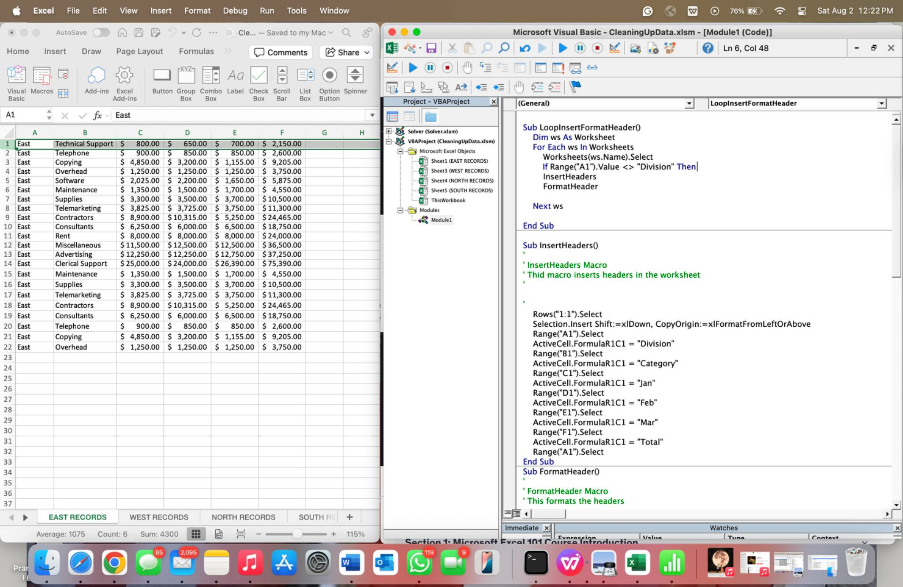

#### ✅ After Running the Macro – View 1
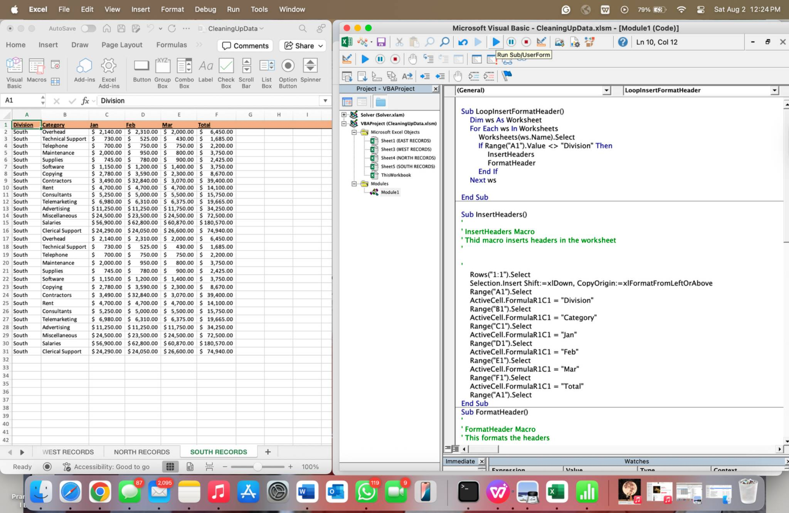

#### ✅ After Running the Macro – View 2
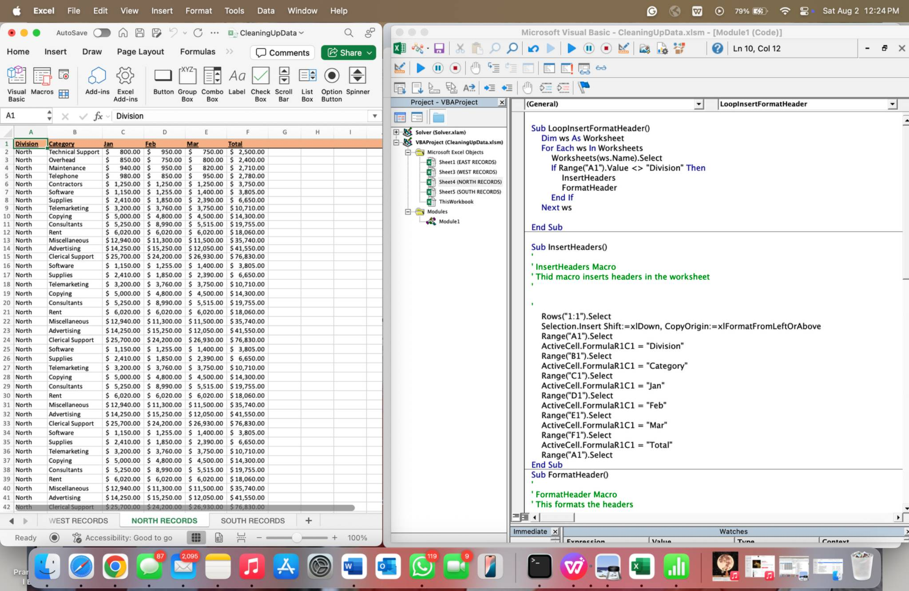


---

## Part 4: Using VBA to Automate Excel Formulas

This part introduces how to programmatically insert Excel formulas using VBA. Specifically, it focuses on automatically calculating column totals across multiple worksheets — dynamically detecting the range and inserting `=SUM(...)` where needed.

### 🔹 Key Skills Covered
- Writing VBA to insert Excel formulas dynamically
- Using `End(xlDown)` and `Offset` to locate the last row of data
- Referencing cell addresses and creating formula strings
- Looping through multiple worksheets and applying calculations

### 📂 File Included
- `AutomateSumFunction.xlsm`: Demonstrates automated insertion of SUM formulas into each worksheet (East, West, South, North).

### 🧰 Concepts Introduced
- **Dynamic Formula Creation**:
  ```vba
  lastCell = ActiveCell.Address(False, False)
  ActiveCell.Offset(1, 0).Select
  ActiveCell.Value = "=sum(F2:" & lastCell & ")"

### 📸 Screenshots

#### 🔍 Before Automation
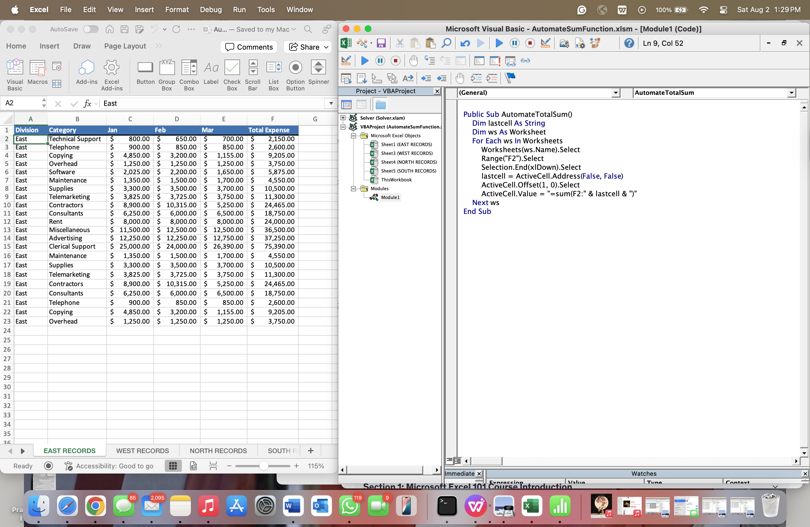

#### ✅ Formula Applied – Example 1
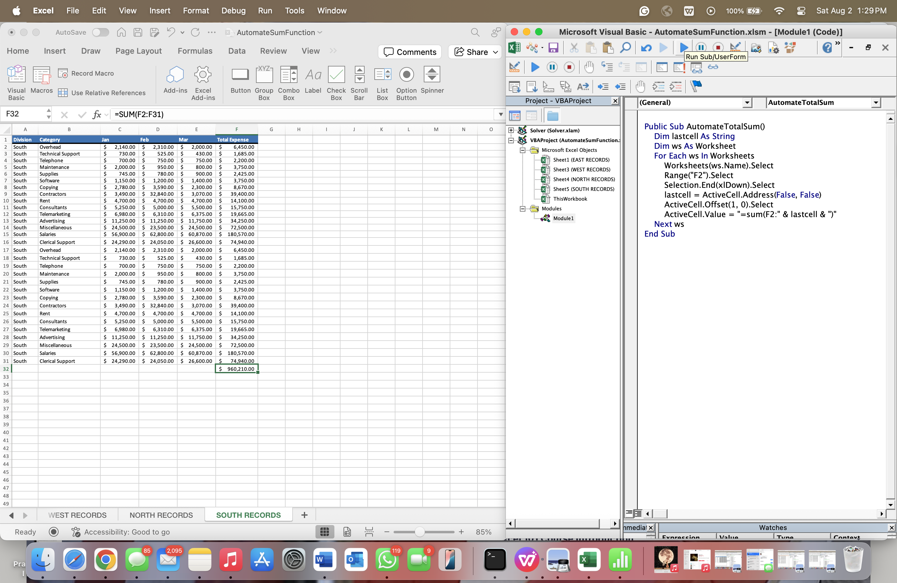

#### ✅ Formula Applied – Example 2


---

## Part 5: Bringing It All Together – Weekly Report

This part combines everything built so far into a complete automation workflow. It consolidates cleaned, formatted, and totaled data from regional worksheets (East, West, North, South) into a master `YEARLY REPORT` sheet — fully automated with VBA.

### 🔹 Key Skills Covered
- Looping through all sheets while excluding the report sheet
- Copying and appending data from multiple worksheets
- Calling reusable macros (`InsertHeaders`, `FormatHeaders`, `AutomateTotalSUM`)
- Automatically applying `=SUM()` formulas to the totals
- Controlling logic with a first-time boolean flag

### 📂 File Included
- `QuarterlyReport.xlsm`: The fully automated workbook generating the final report.

### 🧰 Concepts Introduced
- **Worksheet Filtering**: Skipping the report sheet during the loop 
  ```vba
     If ws.Name <> "YEARLY REPORT" Then
            InsertHeaders
            FormatHeaders
            AutomateTotalSUM
       
### 📸 Screenshots
#### 🟤 Before Running the Macro


#### ✅ After Data Consolidation and Formatting
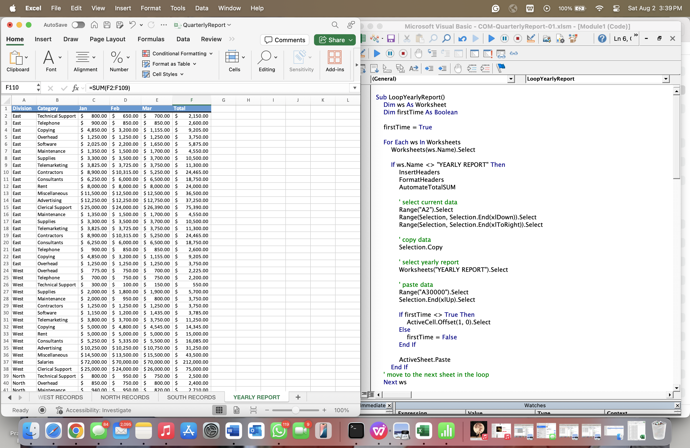

#### 📊 After AutoSUM Applied
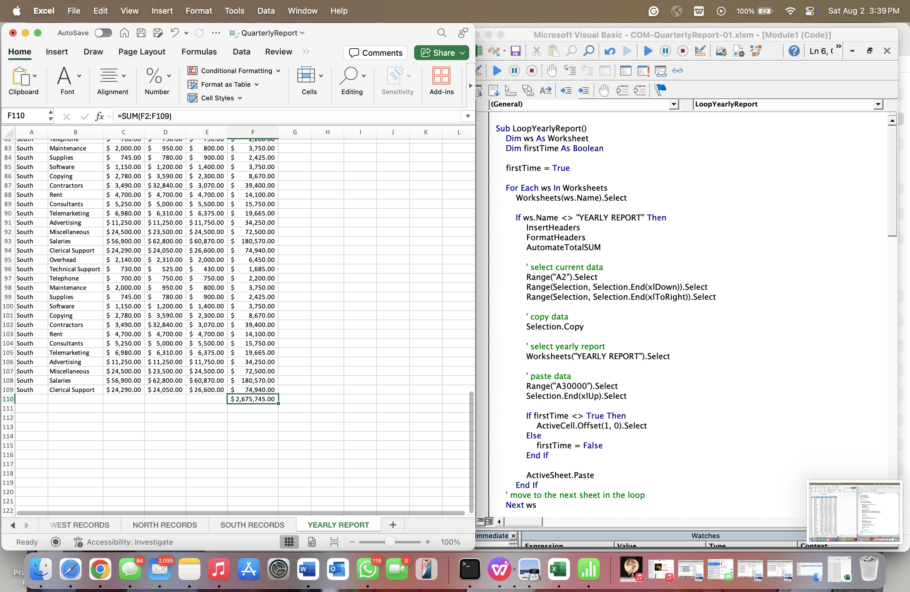


---

## Part 6: Working with Excel VBA User Forms

### 🎯 Objective
In this part, we created a **UserForm interface** to allow users to:
- Select a worksheet from a dropdown
- Add a new worksheet dynamically
- Generate the consolidated yearly report with one click

This enhances user experience by adding interactivity to the automation.

---

### 🧰 Features Implemented
- Custom UserForm with:
  - Worksheet dropdown menu
  - "Add Worksheet" button with input prompt and error handling
  - "Run Report" button to call the automation macro
- Error handling for invalid sheet names
- Dynamic refresh of dropdown based on available worksheets

---

### 🖥️ Screenshots

#### 🪟 UserForm Interface
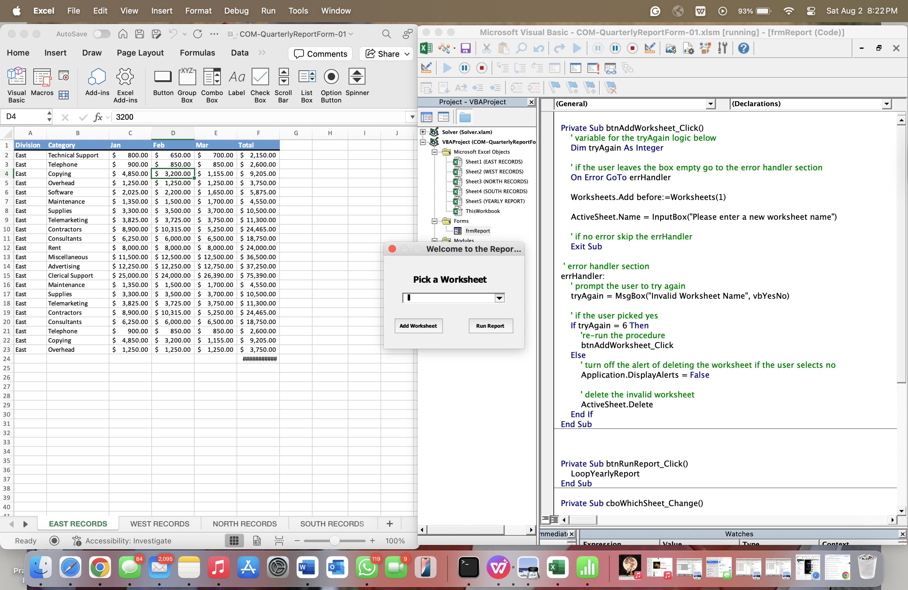

#### 📂 Sheet Selection via Dropdown


#### 🧩 Dropdown Options Populated
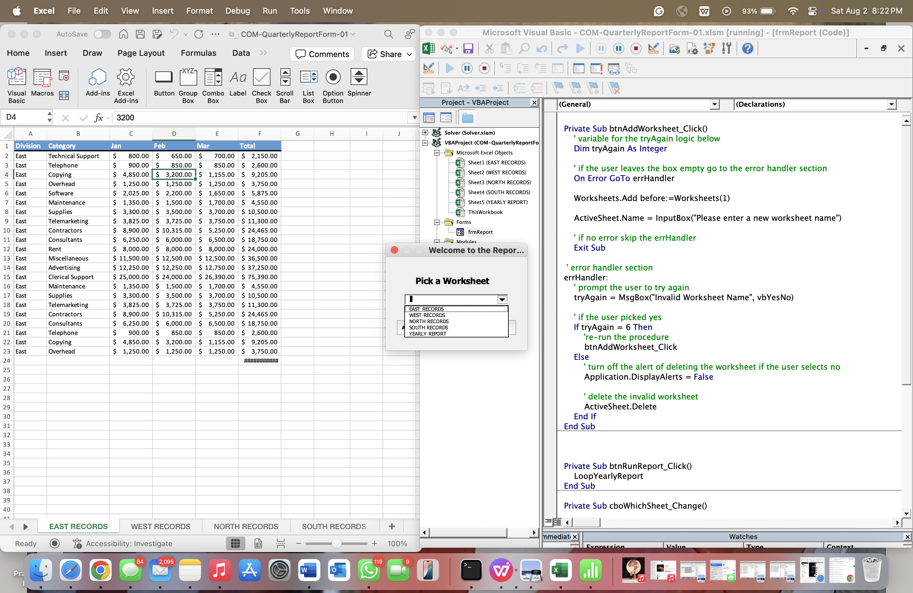

#### 🆕 New Sheet Creation
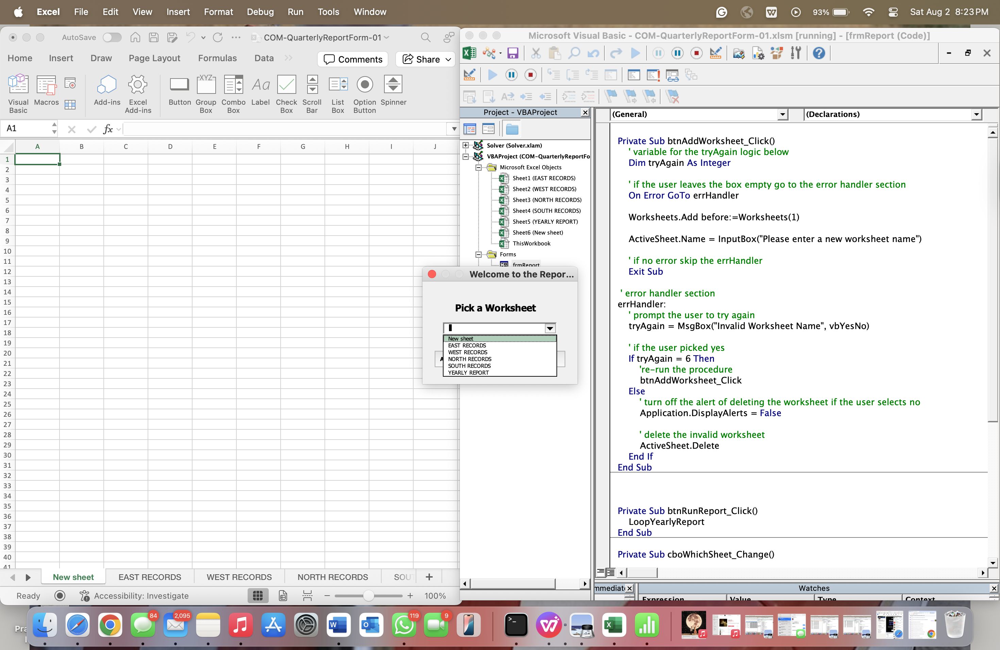

#### 📑 Final Yearly Report
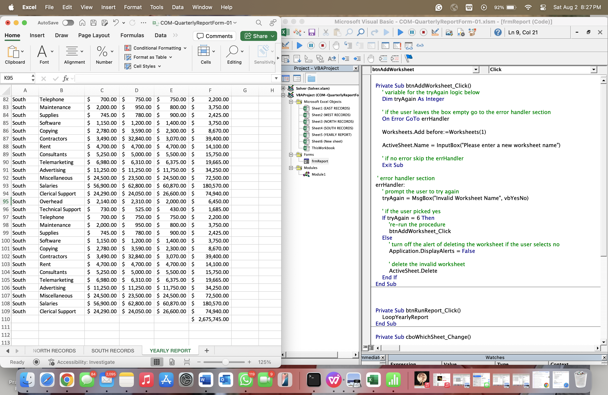

---

### 📁 Files Included
- `COM-QuarterlyReportForm-01.xlsm` – Final macro-enabled file with userform
- Supporting screenshots

---
---

## Part 7: Importing Data from Text Files
> Coming soon: Reading and parsing .txt and .csv files using VBA, with data validation and formatting steps.

---

## 🧠 Summary of Skills Demonstrated
- Excel Macros and VBA Basics
- Data Cleaning and Transformation
- Looping and Conditional Logic
- Dynamic Reporting
- UI/UX with Excel UserForms
- File I/O with VBA

---


---

## 🔗 Author
Reshmitha Marupaka  
Master's in Business Analytics and Artificial Intelligence, University of Texas at Dallas  
[LinkedIn](https://www.linkedin.com/in/reshmitham/) | GitHub: https://github.com/ReshmithaMarupaka24

